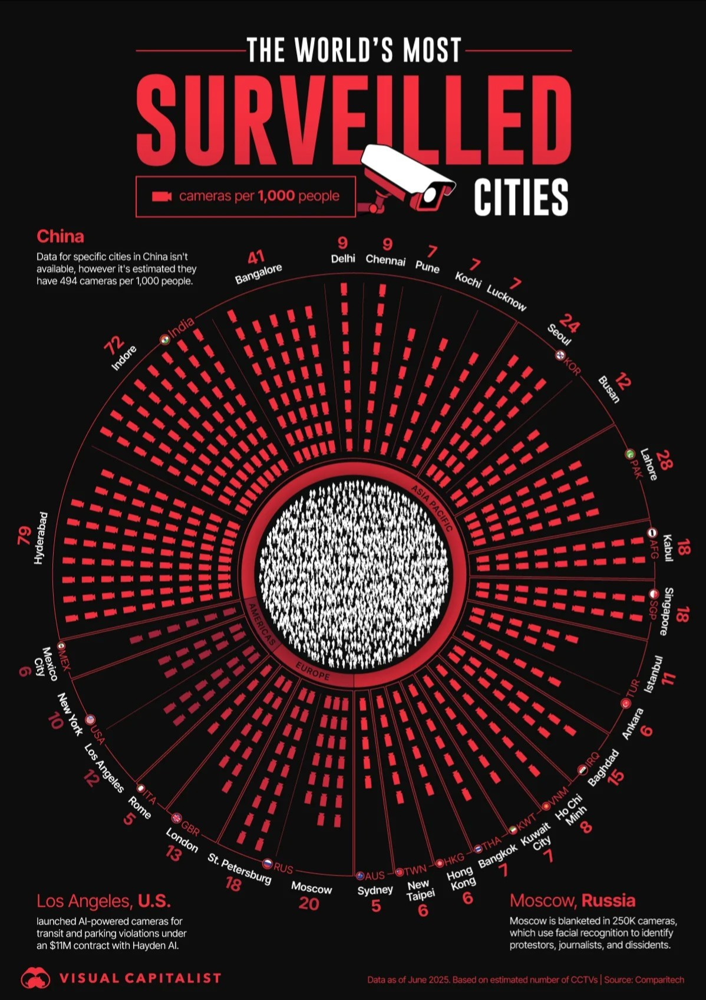
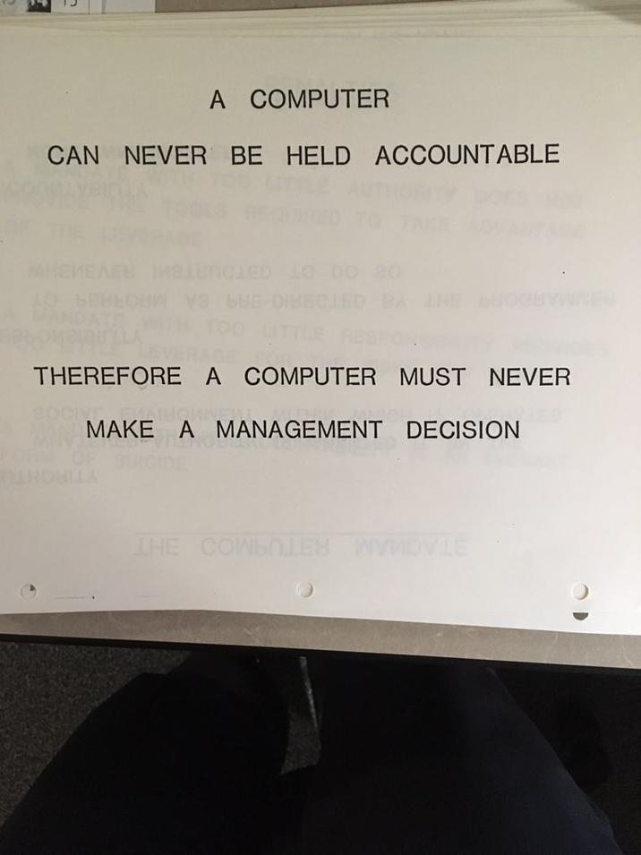

# AI governing humans

Your brain tells you something impending is on its way—some adversary or something bad but the gut feeling won't accept it, stomach is far stronger than the mind and gut feeling often seems to prevail. No matter the reality of the situation, if its something you have never experienced before, it cannot happen.

I have often observed this among the elderly, their times have been too peaceful and they simply cannot comprehend the depth of global geopolitics unfolding. They don't even consider the possibility that whatever horrors are taking place across borders and oceans can as easily occur in their homeland.

{ width="70%" }

India is the most CCTV surveilled country, second only to China and I have known this fact well and yet I never grapsed the gravity of the situation. I have been keeping up with the Flock camera situation of USA and as terrible as it has become I felt a sense of relief since somewhere I felt this cannot happen in my country, atleast not anytime soon.

 

{ .align-left }

The 1979 IBM Training Manual Excerpt is a guideline from IBM’s internal data-processing training materials that explicitly warns against allowing computers to make management decisions, stating: “A computer can never be held accountable; therefore, a computer must never make a management decision.”

The passage underscores mid-20th-century corporate reservations about delegating executive authority to automated systems, emphasizing the ethical and accountability limits of early computing applications in business operations. The excerpt reflects an era when computers were viewed primarily as tools for calculation and record-keeping rather than as autonomous decision-makers, amid the growing adoption of mainframe systems for administrative tasks.

Its resurgence in public discourse during the 2020s, particularly in discussions about artificial intelligence’s role in governance and enterprise, has highlighted its perceived foresight regarding responsibility in automated systems.

 

Reading a newspaper article this morning opened my eyes over how negligent I have really beem to the recent developments in mass surveillance.

The article was about how an AI system in Bengaluru had mistaken a guitar case for pillion rider travelling without a helmet and issued a fine to the rider. A senior police officer admitted that it was indeed a false flag and tends to happen occasionally as the system has not reached a 100% accuracy. Well if its not accurate, the system should not be given the power to automatically issue fines to normal people without being approved by humans in the first place.

This is just one small instance which raises questions about how there is absolutely no publically available information regarding the depths of AI integration in the surveillance infrastructure and the control of automated systems over the lives of normal people.
