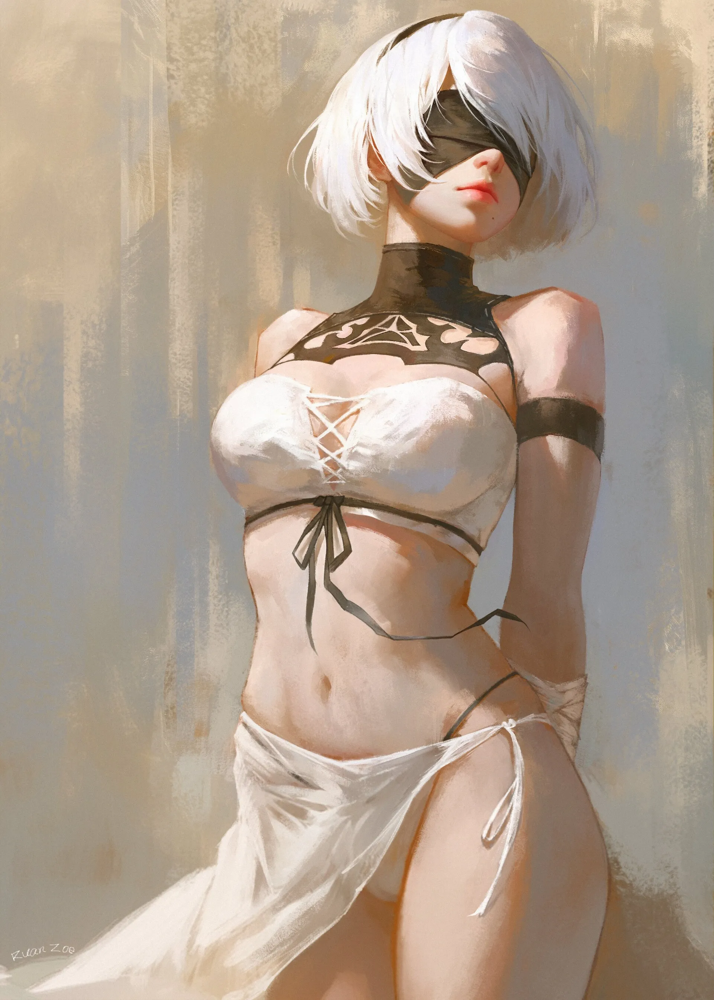
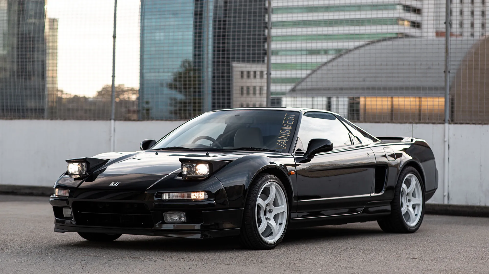

Beauty is something that gives us pleasure and we exercise our control over what gives us pleasure.
It is subjective and cannot be quantified.

Most people{ align=right width="300" } can collectively agree over the beauty of nature. Nature may appear to be random but it is composed of symmetrical structures. We are drawn to the symmetry. The Golden Ratio and Fibonacci Sequence can be found everywhere in nature. Some examples are the pattern of leaves on a stem, the parts of a pineapple, the flowering of artichoke, the uncurling of a fern and the arrangement of a pine cone. The Fibonacci numbers are also found in the family tree of honeybees.

If something is asymmetrical it cannot be beautiful by definition.

Every civilization is defined by its art and when you look at what the modern art puts out, just horrendous, disgusting art, lack of aestehtics and skills without any thought put behind them digusts me. 
I do not understand how anyone can intelluctually appreciate it. A banana tapped to a wall or random splashes of paint on a canvas carry no thought or skill behind them.

I have heard of how this was a CIA psyop where they paid artists like Jackson Pollock and others who would just randomly splash paint over a white canvas. The beauty of the art itself was not inherent but artificially constructed in the minds of people for whatever reason perhaps for confusing the Russians because their architecture and aestehtics were how US usead to have but lost to time (admitted by CIA) but none the less it had a huge impact globally in shaping the modern culture and beauty itself.

Todays architecture carries no soul. Its hostile and intentionally designed to evoke feelings of disgust in the mind. Not to mention the lack of symmetry.

We need beauty around us, our surroundings impact our thoughts and behaviour subconciously and when they are degraded, it impacts our ability to think and enjoy and find our own happiness in life. We are all drawn to beauty, look at the classical art, the art produced by ancient Greeks, things worth worshipping.

There is nothing mainstream in our world that is beautiful be it music or art. Infact there has been nothing beautiful produced since I was born.

I absolutely love cars of the past century, no matter which aspect you dive in, they were beautifully crafted machines built to last compared to modern cars. 

                        
 
1991 Honda NSX 

Modern cars are shitboxes designed very intentionally to be shit in every aspect imaginable, overdone and collecting user data for selling to data brokers. Sure modern cars are more reliable and better, the technology has advanced but they lack beauty.

A beautiful video on YouTube that explores the decline of car design:
 [We're In the Dark Ages of Car Design](https://www.youtube.com/embed/Hq170ByWnC4)
