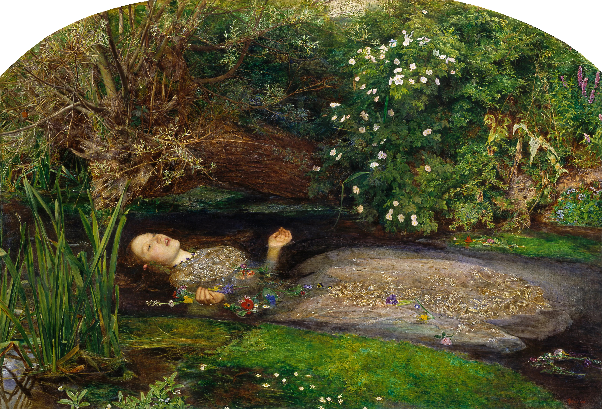

# Death

 Ophelia by John Everett Millais, 1851-1852 

 

Ever since you were a baby, you have been consuming food. Some of the food becomes a part of your body as you grow while some of it is metabolised to produce energy. Different cells of the body are constantly being replaced by new ones as they reach an end of their cycle.

The brain is composed of billions of neurons interconnected and constantly forming new connections while modifying previous ones. A single neuron has a simple function i.e. to transmit a nerve signal to the next neuron but when many come together a concious mind emerges. A few specific neurons form strong connections when you make a memory.

Memories are not facts but an interpretation of reality which makes them unreliable. The neurons of the brain do not divide as frequently as other cells because that would alter the pre-existing connections which make you – you.

You are not the same person as you were say a month ago, today you are slightly older and slightly wiser, your neuron network has undergone considerable changes since then.

It is often observed that people whose parts of brains are severed in accidents or surgically removed loose the functions associated with the lost portion whereas those who suffer from Dementia slowly loose various functions which results in a decline in thinking, memories and daily activities. Patients with brain deaths are medically declared dead. Their bodies may continue to function on life support systems but the person no longer exists.

Death occurs when neurons slowly start shutting down and the conciousness that emerged from them simply cease to exist.
