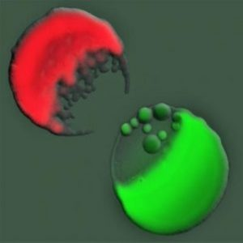

# Morality and Death

*Cleopatra Testing Poisons on Condemned Prisoners by Alexandre Cabanel (1887)*

A lot of people are unable to accept the fact that we are just another animal living on this planet. The main things that differentiates us from others is our unique cognitive abilities and the ability to defy our instincts. But just like other animals our time on earth is limited. 

Religions played a major role in linking morality with death and instigating the false belief of our superiority over other living beings.

Many religions base their importance of moral actions on how they impact what happens to you in the afterlife, whether that is a concept of Heaven or Karma. 

Today in most cultures, death is perceived as something to be dreaded however all these implications assigned to death are intrinsically human and the attempt to define and enforce morality is solely a humanitarian endeavor. 

## Morals

Morals are a set of rules which are specific to a human group that essentially allow social peace, social cohesion, cooperation, etc. The ultimate objective of morals is the survival of the group. [1]

Not all groups share the same rules because if morals were universal then all the the groups would follow them to maximize their survival. 

Various moral systems have come and gone in history suggesting as if they were guided by natural selection a trival conclusion of social darwinism. The systems of today are still evolving because if they reached a perfect state all wars would cease.

### Moral Dualism

**Moral dualism** refers to the worldview in which the moral universe is sharply divided between “us” and “them,” light and darkness, purity and corruption. [2]

The good vs evil narrative is a propaganda heavly promoted by Governments and other entities to achieve  their objective through radicalization and fragmentation of followers. 

It is everywhere be it the Hollywood or literature and has complicated the true understanding of morals.

### War

War appears to be a deeply human invention but its not as artifcial as we think of it to be.

#### Bacteria

*Two bacterial colonies of E. Coli battling on agar visualized through fluorscent dyes.*

A bacteria cannot survive alone however given it's ability to divide quickly even one can form a large colony in the right conditions.

But the higher is the population, more will be the pressure on the resources in a constrained area just like for anh other species. This is why bacterial strains show an aggresive behaviour towards other strains even of the same species.

Many species use toxins to kill and inhibit their compititors in a coordinated attack by relaying information quickly to release toxins in high amounts.
#### Human Beings

 Humanity has divided itself into groups known as countries and these countries are constantly under pressure for the limited natural resources. Therefore war may lead to great number of individual deaths but it improves the survival of the species.

War also suggests that morals are not universal.

1. Different societies will always differ in abilities, knowledge, resources, and so on.
2. Different societies will also have different interests.
3. So, societies will always have conflicts of interest.
4. Those conflicts are resolved partly through dialogue and partly through war.
5. Therefore, a truly universal set of moral principles would be incompatible with the necessity of war.

### Moral Differences

We have observed that morals cannot be universal. Your morals will differ from mine not because we think differently but we are different. Each of us has different history, the environment we grow in, knowledge, abilities and so on. These are qualities that makes us unique and lead us to follow seperate rules.

As an example you might be vegetarian and find it immoral to kill domestic animals but my morals justify eating meat because prey-predator relationships are a part of nature.

## Death 

Death is universal, be it life on earth or the stars, our deaths are inevitable. In both these cases, the identity of the 'thing' which had undergone death simply changes. 

### Nature of Death

Death is an adaptation of life to develope and become stronger in the changing environment.  It allows life forms to evolve and undergo changes at a much faster rate. Therefore death allows life to meet the changes of nature better. An immortal being would not be able to evolve and adapt.

Therefore death allows life to survive not as individuals but as a species.

The death of a child may be shocking to human sensibilities and we may consider the laws of nature vicious. But nature is neither good nor bad, it just simply is.

### Our Biological Death

The brain is composed of billions of neurons interconnected and constantly forming new connections while modifying previous ones. A single neuron has a simple function i.e. to transmit a nerve signal or release neurotransmitter to the next neuron but when many come together a concious mind emerges.

It is often observed that people whose parts of brains are severed in accidents or surgically removed loose the functions associated with the lost portion whereas those who suffer from Dementia slowly loose various functions which results in a decline in thinking, memories and daily activities. Patients with brain deaths are medically declared dead. Their bodies may continue to function on life support systems but the person no longer exists.

Death occurs when neurons slowly start shutting down and the conciousness that emerged from them simply cease to exist along with the various biological processes that once sustained it.

Eventually our bodies will be decomposed by microorganism and the atoms that once composed us which we aquired through food will simply move on to be a part of something else.

Therefore the only thing that will truely cease to exist after our deaths is our conciousness.

### Meaning of Life

Today we adopt a myriad of ideologies, political beliefs and so on. We are born unequal, grow up surrounded by different beliefs and these differences will only mature in the future. 

Nature is completely alien to these human concepts or rather it does not care for it simply smiles on the process of selection from diversity.

 Today our science tells us that life will not survive for forever, eventually this small rock will be depleted of all its life sustaining resources, its core will froze, oceans will dry up.
 
 Our Sun will itself become a red dwarf and engulf Earth along with Mercury and Venus in a few billion years. Saturn's ring will collapse over the course of millions of years and so on.

I think that life is the most beautiful accident to happen in this universe and everyone should be able to appreciate the significance of it.
### Death of the Stars

*The astounding variety and amazing complexity of planetary nebulas captured by Hubble.*

The stars die in different ways depending on their mass. Smaller stars like the Sun will expand into red giants and eventually shed their outer layers to form planetary nebulas, leaving behind a white dwarf, while massive stars will explode in supernovae, leaving behind neutron stars or black holes.

A beautiful interactive representation of a star's death can be found here :
[**Star Death:** Helix Nebula](https://viewspace.org/interactives/unveiling_invisible_universe/star_death/helix_nebula)

Isn't it ironic that I find theses nebulas after the death of the stars to appear more beautiful than the stars themselves.

## The Future

Death will continue to influence our lives for the time immemorial and our morality will continue to haunt us with big questions that science or philosophy cannot answer.

## Reference

1. Hodge, John. (2012). Survival is the only moral goal of life, https://www.researchgate.net/publication/329209019_Survival_is_the_only_moral_goal_of_life

2. Louis, Anthony & Festus, Wilson & Abel, Wilson. (2025). GOOD VS. EVIL IN MODERN PROPAGANDA: MORAL DUALISM IN SOCIAL MEDIA NARRATIVES AND YOUTH RADICALIZATION, https://www.researchgate.net/publication/391672626_GOOD_VS_EVIL_IN_MODERN_PROPAGANDA_MORAL_DUALISM_IN_SOCIAL_MEDIA_NARRATIVES_AND_YOUTH_RADICALIZATION

3. Mavridou DAI, Gonzalez D, Kim W, West SA, Foster KR. Bacteria use collective behavior to generate diverse combat strategies. *Current Biology*. 2018;28(3):345-355.e4. doi:10.1016/j.cub.2017.12.030.
   https://www.cell.com/current-biology/fulltext/S0960-9822(17)31663-9

4. Pyszczynski, Tom, and Pelin Kesebir. “Culture, Ideology, Morality, and Religion: Death Changes Everything.” ResearchGate, Jan. 2011, https://www.researchgate.net/publication/228172741_Culture_Ideology_Morality_and_Religion_Death_

5. The Death Throes of Stars, NASA, https://science.nasa.gov/mission/hubble/science/science-highlights/the-death-throes-of-stars/

