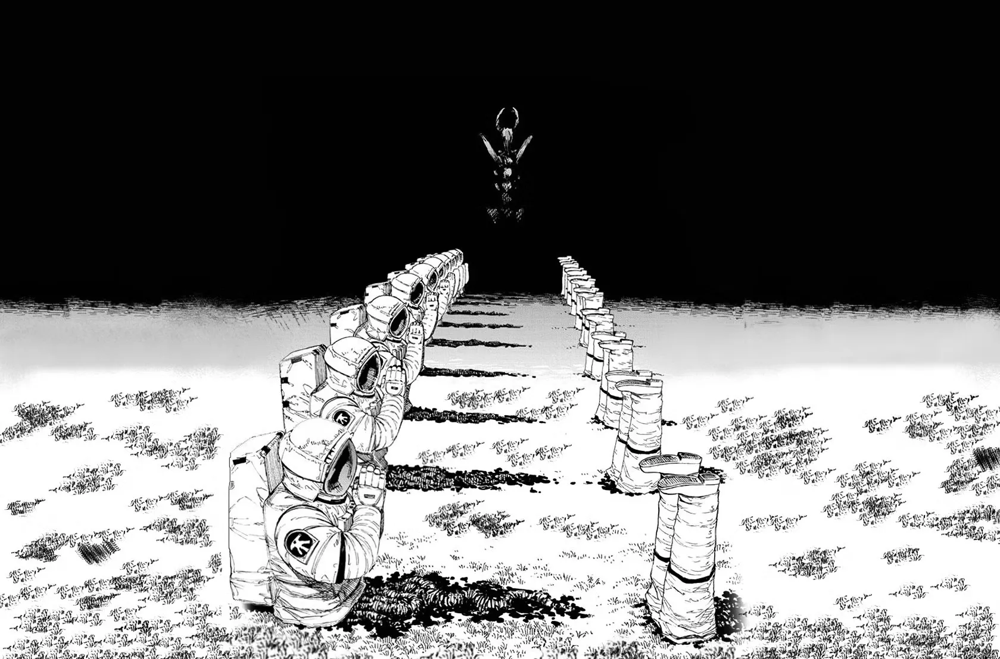

# 
DHARMA&nbsp;&nbsp;&nbsp;धर्म

<b>The universal truth common to all individuals at all times.</b>

 

“You cannot be governed; you just didn’t realize it yet.”

— <a href="http://nowherejezfoltodf4jiyl6r56jnzintap5vyjlia7fkirfsnfizflqd.onion/index.html">Nowhere Community</a>

 

# Welcome to DHARMA
This is my personal webpage in a small corner of the darknet. I haven been wanting to write a diary for the longest time but it always felt like a daunting task.
This page exists to be a not so personal diary of me where I write about the things I learn and experience.

### Why host a static website over tor network instead of just using social media ?

In short, because the [Internet is DEAD](dead_internet_theory.md)

I had my first exposure to the internet back in 2011 when my dad bought a personal computer home. Those were simple times, I would spend hours playing flash games, trying to discover the things that mattered to me on YouTube and internet.

The internet of today is particularly defined by a few social media sites controlled by tech giants who dictate the surveillance capitalism economy. It comprises more bots than humans. It is so frustrating to look up something and be bombarded with ai slop websites which are all a copy of eachother.
The search engine [Marginalia](https://marginalia-search.com) has been really a lifesaver alowing me to search through human curated content and the darknet has become my sanctuary where I can still meet and talk with real and like minded people online.

And lastly I can talk about whatever the heck I want to freely without worrying about any censorship or judgement. Not relying on the state to enforce my right to speech but enforcing it myself.

>All the content here was written by me to the best of my understanding and can be inaccurate. It is my fundamental belief that my knowledge will never be complete and accurate but I strive to stay close to the [Objective Reality](reality.md#2-objective-reality) and in fact it is the purpose of my short human life, a dream that drives my will to live.
