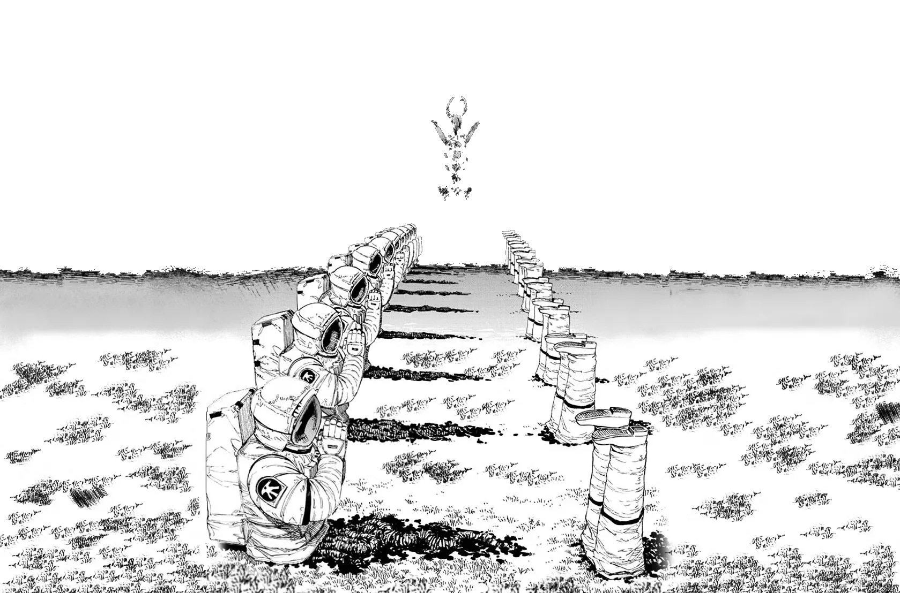

# 
DHARMA&nbsp;&nbsp;&nbsp;धर्म

<b>The universal truth common to all individuals at all times.</b>

 

“You cannot be governed; you just didn’t realize it yet.”

— <a href="http://nowherejezfoltodf4jiyl6r56jnzintap5vyjlia7fkirfsnfizflqd.onion/index.html">Nowhere Community</a>

 
# Welcome to DHARMA
This is my personal webpage in a small corner of the darknet. I haven been wanting to write a diary for the longest time but it always felt like a daunting task.
This page exists to be a not so personal diary of me where I write about the things I learn and experience.

### Why host a static website over tor network instead of just using social media ?

In short, because the [Internet is DEAD](dead_internet_theory.md)

The internet of today is particularly defined by a few social media sites controlled by tech giants who dictate the [surveillance capitalism](panopticon.md#surveillance-capitalism) economy. It comprises more bots than humans. It is so frustrating to look up something and be bombarded with ai slop websites which are all a copy of eachother.
The search engine [Marginalia](https://marginalia-search.com) has been really a lifesaver alowing me to search through human curated content and the darknet has become my sanctuary where I can still meet and talk with real and like minded people online.

And lastly I can talk about whatever the heck I want to freely without worrying about any censorship or judgement. Not relying on the state to enforce my right to speech but enforcing it myself.

  

    <!-- Window controls -->
    

      <button class="terminal-control terminal-minimize"
              aria-label="Minimize"
              title="Minimize">−</button>

      <button class="terminal-control terminal-maximize"
              aria-label="Maximize"
              title="Maximize">□</button>

      <button class="terminal-control terminal-close"
              aria-label="Close"
              title="Close">×</button>
    

    <!-- Normal terminal -->
    

      

        user@dharma:~$
        cat Featured_Article.txt
      

      

        $
        <a href="./panopticon" class="terminal-link">
          You are a Commodity
        </a>
      

      

        user@dharma:~$
        
      

    

    <!-- Maximized terminal content -->
    

      

        user@dharma:~$
        tree
      

      <pre class="tree-output">.
└── dharma
    ├── docs
    │   ├── *.md                 # Articles/topics
    │   ├── blog/                # Blog + posts
    │   ├── img/                 # Images
    │   ├── resources/           # Books + surveillance PDFs
    │   ├── javascripts/         # Site JS
    │   └── stylesheets/         # CSS
    ├── mkdocs.yml               # MkDocs config
    └── site/                    # Generated static website
        ├── */index.html         # Built pages
        ├── assets/              # JS/CSS/search assets
        ├── img/                 # Built images
        └── resources/           # Built PDFs/resources

      

        user@dharma:~$
        
      

    

  

