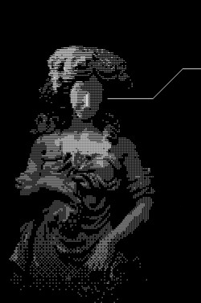

{ align=left }

|  | Philosophy |  |
|---|---|---|
| [Introduction](introduction.md) | [Understanding Reality](reality.md) | [Morality and Death](death.md) |
| [Superstition and Belief Systems](superstition.md) | [Postmodernism](postmodernism.md) | [Beauty](beauty.md) | 

I have tried to read books on philosophy, particularly the famous ones whose name gets thrown around quiet often, hoping it would provide me answers to all kind of big questions but I could never make sense of anything and quickly lost any motivation to continue. The reason was becuase philosophical works are experiences and beliefs that people try to put into words. They don't make sense to you unless you already know and understand them. Therefore it is important to pick the right book.

It's natural to question the meaning of life, to suddenly become aware of the structure of life we don't notice daily. One of the first such moment occured to me when I beleive I was around the age of 5. I was lying down on my bed and looking at my hand I just wondered; how is it that I am moving my hand and fingers. They move how I intend them to but how does it happen. It felt weird and still does whenever I do it. I don't do it intentionally, the thought forms out of nowhere and I just take a step back from whatever I maybe doing and just contemplate about it.

Sometimes you just wonder; why am I doing whatever I do. Getting up in the morning, going to work, indulging in a hobby, taking a break, going to sleep and repeating it all over again.
You can try and contemplate the reasons following a chain of causality until you reach a point where you can no longer further relate it to a deeper underlying cause. This final cause will always be subjective, perhaps it's your preference and desire. It's something that matters to you and therefore it gives you a meaningful reason to exist. 

This fundamental self justifying principle a person may conclude is never objective and therfore not universal. 
A religious person may live for a God, that's what gives their life meaning whereas someone else who cares for their children works to provide them a good life.

If I try to reach an objective conclusion with Science, I would mention Darwin's Theory of Evolution. The purpose of any living organism is to survive long enough to give birth to their offsprings and ensure the continuity of their species. Perhaps this is why most people have children and wether they liked the tidious process of having children or not, their life will likely be more meaningful than people who don't have children.

But I personally do not resonate with it. I have formed my own subjective underlying reasons which I find meaningful to some extent. I value knowledge and understanding objective reality, and I am constantly seeking answers to many questions be it big or small. For some reason the fact that so many things remain unknown to humans consoles me.

Perhaps life’s very meaninglessness allows everyone to find their own meaning.

In the philosophy section I write about things from my perspective, I do not intend to convince anyone of anything. Someone whose beliefs and experiences are similar to mine might find my content resonate within them while another person might find it sensless or false.   
