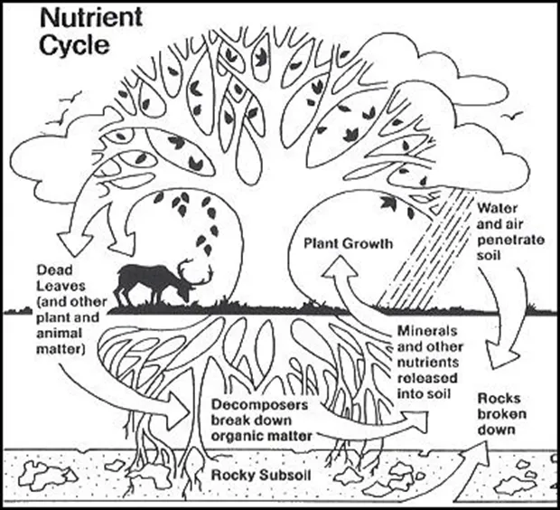

# Ownership

Before writing was invented ownership was a communal aggreement within a community. A person for instance could say that a certain field belongs to him and no one else can graze their cattle on it. But a king far away wouldn't know who the land belongs to.

In the mesopotamian civilization when writing was invented, suddenly a clay tablets incribeded with symbols could keep a record of what part of land belongs to who and now the owner could even trade the piece of clay table for gold.

The king could keep an archive and know who owned what.

The modern ownership of property has been largely similar. To own something means to possess an enforceable claim to it and the responsibility of protecting that claim lies with the state.

### Owning Land

*The basic nutrient cycle shown above, illustrates how the nutrients move from the physical world into the living world and return to the physical world. Nutrient cycles have “self regulating mechanisms” (Borman & Likens, 1967) to keep ecosystems in balance.*

 

The land however is not an abstract asset but a part of ecological balance.

We are composed of the same atoms that make up the Earth, we are essentially born of Earth and depend on the natural food chain for our survival. Sure sunlight provides the necessasry energy to the plants to keep the cycle running but the atoms keep recycling.
And most importantly after our death, we will recycle our nutrients back into the Earth.

Well except if you want to be cremated after death and pollute the atmosphere instead of recycling the nutrients bypassing the decomposition stage.

So how can we own a piece of land or any other part of biosphere, what gives us the authoirty to exercise control over nature. To destroy the ecological balance for a comfortable living. 

### The Original Sin of Property

So somehow someone claims the unclaimed land for the first time which keeps getting passed on and divided for centuries. The first person might have somehow claimed it for no cost ? Or perhaps the kings captured the lands and claimed them into their territory, distributed them among their people in exchange for physical work or money and enforced taxes.

It's not much different with modern wars centered around the finite avalability of resources:

- Russia is trying to claim back the region which is Ukraine for its resources and it might also result in a greater control over the Black Sea and its shipping routes.
- China want's to get Taiwan and South China Sea.
- USA captured Venezula for its oil and eyes Greenland to control the western hemisphere and their resources.
- The examples are endless.

Being able to own pieces of land by normal people as well as State backed land required States to enforce their rights which in turn required the partitioning of lands with imaginary borders. This culminates into the need for endless wars and armies to defend the land, because if captured by a foreign power, it might not really recognise the enforceable claim people once enjoyed.

### Summary
How do humans justify exclusive control over land and resources that are part of a shared, living biosphere? Property rights make social order possible, but they also depend on borders, enforcement, and state power. In that sense, ownership is not purely natural; it is a legal and political arrangement layered over the physical world.
