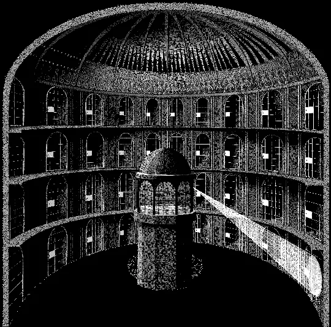
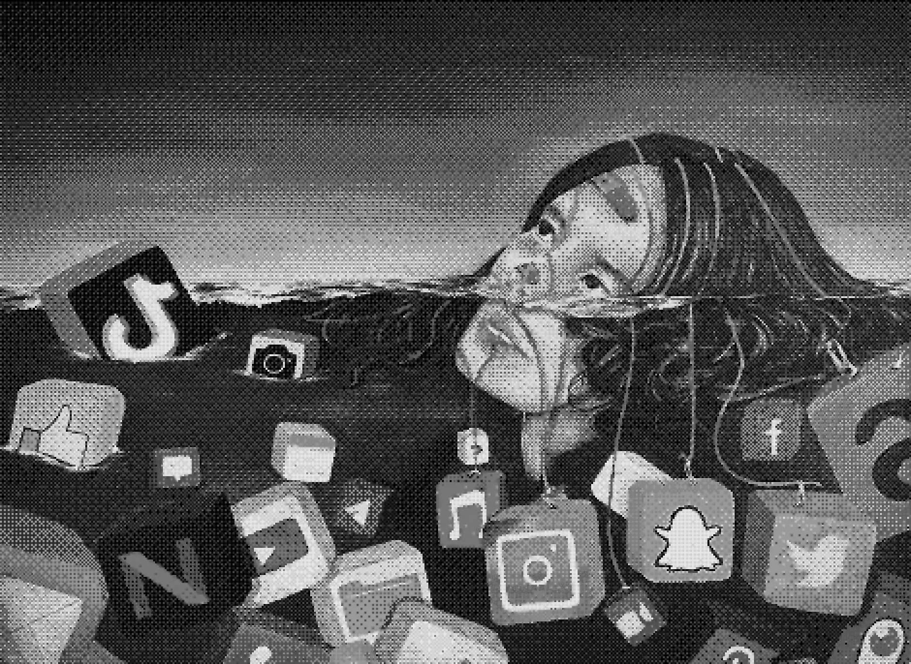
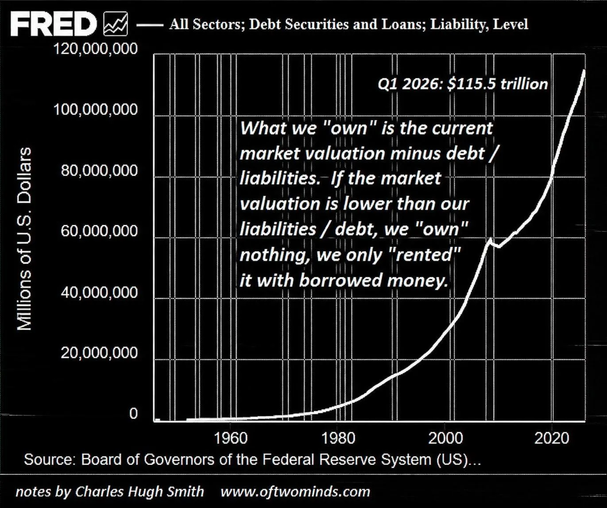

# You are a Commodity

### _**I was born into an age where I do not own my soul.**_

## The Beginnings

Throughout the relatively short human history, those in power have always tried to control and suppress the masses. However for the longest time it proved extremely challenging due to the inability to obtain information on everyone. The greatest Kings could not micromanage the social, economic and cultural lives of every individual but could only do so much with the limited information such as enforcing taxes to raise armies and punishments to ensure that the majority remained governable.

## The Dawn and Reckoning of Science

>_“The Empire of Scientism will constitute governance of the machine, by the machine, for the machine.”_

~ James Tunney

 
The late 1600s marked a decline in religion and in Platonic and Aristotelian views, while science and reason were embraced as forces that would bring great advancement to humankind which could not be further from the truth. But they have always been used to serve the age-old need of those in power to control the herd.

### Postmodernism

The aftermath of immense death and destruction at the end of two World Wars followed by the Great Depression led many to rethink the true nature of science. As the belief kept withering, emerged a new movement called Postmodernism which critiques science by arguing that it is just another system of knowledge that lacks true objectivity, suggesting that science is influenced by social and political contexts rather than being a purely objective pursuit of truth.

The postmodernism movement is meaningless because it adds nothing to analytical or empirical knowledge. Science is humanities greatest gift to uncover objective reality and continues to serve us in innumerable ways.

Science cannot be morally judged for it simply waits to be used by humans who decide how to use it.

>_“I know not with what weapons World War III will be fought, but World War IV will be fought with sticks and stones.”_

~ Albert Einstein

 
This shows that humans would wage war even without science, for conflict is rooted in human nature itself.
### Weilding the Power of God

The Nuclear Weapons were the pinnacle of destruction of the 20th century that did not only killed millions with their newfound destructive power but set in true terror in hearts of all humanity.

Its been 81 years since their inception and while they enjoyed a period of dominance in the previous century, nukes were eventually succeeded by something far greater in the 21st. A weapon which decended from the very heavens, meant to be used only by **God** — omnipresence, the ability to be at all places at all times.

*The age old desire of information was achieved.*

*Those with this weapon peered above kings, rising higher than emperors, while holding entire continents in the hollow of their hand.*

## Death of Individualism

Sonder is a neologism coined by John Koenig on his website defined as; (Koneig)

*The realization that each random passerby is living a life as vivid and complex as your own—populated with their own ambitions, friends, routines, worries and inherited craziness.*
 
As my life has continued on, I feel the spread of sonder has been diminished.  It makes me feel lucky to be born barely late enough to have experienced it. 

It is a rarity to look somebody in the eye and see the complexities that built them into the individual I stand in front of, instead we envelop ourselves in the stereotypes and effigies that devices show us, killing the individual behind the screen for a mere representation. Social media titans have reduced us into data points to maximize profits, but they have also reduced the individual within the content they propagate.

As we scroll through thousands of images of friends and family, we scroll through snapshots of their lives that fit into a false archetype, an idealized album of their lives that revokes their humanity and only leaves an impression. 

Mass surveillance goes beyond simple paranoia and principle; it is the death of sonder, the commodification of society.

## Privacy

Privacy is a fundamental human right, without privacy no person can be themselves, think independently and act independently out of their own free will.

It  protects the core of what makes us human —our dignity, autonomy, and ability to live freely.

## Why do we need it ?

The basic definition does little in justifying the importance of privacy.

Privacy, as Klitou puts it, is a means for protecting liberty. In his book, Privacy-Invading Technologies and Privacy by Design, Klitou highlights the importance of personal privacy for sustaining other civil liberties. Most notably, he describes a “chilling effect” enacted by surveillance as it acts as an invisible looming threat impeding “respectively on: the right to vote; the freedom of assembly; the freedom of speech; freedom of the press; the freedom of movement; and, thus, democracy overall”. 

The value of privacy derives from its importance in our ability to perform, preserve and protect our humanity on an independent and societal basis.

## Digitilization of Society

Every aspect of our lives has been digitized, The Information Age sparked a rebirth in how society operates on a fundamental level. However, this renewal is mandatory, technological literacy and connection is essential for socio-economic survival and success in the modern age. 

The internet is now embedded in the core aspects of our participation in society; the educational, occupational, social, political, and other aspects of life all depend on compliance with internet titans. Hence there is no escape from the grasp of the machine. 

At the heart of this assimilation are billion-dollar corporate giants who extort this dependence to incline the world to surrender their privacy. 

This section will address two societal pieces that corporations envelop and commandeer to grow their empire:

### Life: 

Windows, IOS and Android operating systems remain the dominant operating systems today. Every device running any of these constantly gathers huge amounts of user data.

Everything is connected today. Internet of things (IoT) devices have continued to grow more popular. Smart watches, fridges and a myriad of other appliances. 
You are not in control.

### Education: 

Meta's whatsapp platform entered my life when I was still in 9th class. It was inevitable, the school promoted it for keeping up and it continues to haunt me even now in my final year of university. 

Whatsapp lies about encryption and spies on all messages. It employs heavy meta data monitoring and represents one of the many data collection points in Meta's ecosystem.

The pandamic forced me to use video conferencing tools for the first time and I still depend on these paltforms.

I was assigned a Google email address when I joined university. It is required to log into the student portal, attempt quizzes, and submit assignments that carry grades.

I had no choice but to let them eavesdrop on me.

I have always avoided logging into Google Classroom to access study material uploaded by my teachers, and I have relied on my good friends to forward the content to me.

I have inevitably missed filling out many Google Forms from my university, and I have also skipped using Gemini AI to help with my review paper, despite my teacher’s instructions.

Google actively promotes its products to students for education.

As of October 2026, Google Workspace for Education has reached over 170 million students and educators across 230 countries and territories. With Gemini AI integrated into more than 1,000 US higher education institutions and a $1 billion commitment to AI training programs through 2028.

If students continue to rely on Google's products into adulthood, those millions of children become millions of new people to observe and advertise to.

## The Rise of Panopticon
 

 
The panopticon is a prison design by Jeremy Bentham with a central guard tower that can see into every prison cell, but the inmates cannot see into the guard tower - unable to know if they are being watched. 

Today, the panopticon serves as a powerful metaphor for the state of digital surveillance. Government agencies and corporations alike look into every aspect of our lives, but we are unable to look back. A panopticon is not built overnight, and neither is a data empire. The development of a surveillance-enveloped world was a slow, meditated descent as a result of continued willful ignorance, extenuation, and bewilderment.

### What Constitiutes the Panopticon

Panopticon is not technology; it is a logic that imbues technology and commands it into action. 

Panopticon employs many technologies, but it cannot be equated with any technology. Its operations may employ platforms, but these operations are not the same as platforms. It employs machine intelligence, but it cannot be reduced to those machines. It produces and relies on algorithms, but it is not the same as algorithms. 

It is the puppet masters that hide behind the curtain orienting the machines and summoning them to action.

## Surveillance Capitalism

Surveillance capitalism unilaterally claims human experience as free raw material for translation into behavioral data. Although some of these data are applied to product or service improvement, the rest are declared as a proprietary behavioral surplus, fed into advanced manufacturing processes known as “machine intelligence,” and fabricated into prediction products that anticipate what you will do now, soon, and later. Finally, these prediction products are traded in a new kind of marketplace for behavioral predictions known as behavioral futures markets.

Just as industrial civilization flourished at the expense of nature and now threatens to cost us the Earth, an information civilization shaped by surveillance capitalism and its new instrumentarian power will thrive at the expense of human nature and will threaten to cost us our humanity.

It is capitalism that assigns the price tag of subjugation and helplessness, not the technology.

That surveillance capitalism is a logic in action and not a technology is a vital point because surveillance capitalists want us to think that their practices are inevitable expressions of the technologies they employ. 

#### Google: The pioneer of Surveillance Capitalism

Google is a notoriously secretive company and its operations are not easily accessible to outside researchers or journalists.

Google’s invention of targeted advertising paved the way to financial success, but it also laid the cornerstone of a more far-reaching development: the discovery and elaboration of surveillance capitalism. 

Its business is characterized as an advertising model, and much has been written about Google’s automated auction methods and other aspects of its inventions in the field of online advertising.

Today more or less everyone depends directly or indirectly on Google and it collects information about every single aspect of their lives.

## Invisible Chains

When portraying surveillance, it is important to highlight that the party on the other end of the camera is not an indifferent statistician. The goal of surveillance is not simple analytics, it is a tool for manipulation. The ethical significance of digital surveillance spans beyond the simple right to oneself, but the right to self-determinism, the right to _be_ oneself.

An extremely powerful example of this surveillance tenet is social media websites. Modern social media platforms have three main goals; captivate, extract and manipulate. These three pillars are an interdependent and self-sufficient system to keep users addicted to a platform in order to extract more and more information about their psychology. This information can then be utilized for better-optimized content to keep the user ensnared by the program. Social media platforms have created invisible chains that constrain and puppeteer the lives of billions.

### Addiction

“I felt so lonely… I could not sleep well without sharing or connecting to others,” a Chinese girl recalled. “Emptiness,” an Argentine boy moaned. “Emptiness overwhelms me.” A Ugandan teenager muttered, “I felt like there was a problem with me,” and an American college student whimpered, “I went into absolute panic mode.” These are but a few of the lamentations plucked from one thousand student participants in an international study of media use that spanned ten countries and five continents. They had been asked to abstain from all digital media for a mere twenty-four hours, and the experience released a planet-wide gnashing of teeth and tearing of flesh that even the study’s directors found disquieting.(4)

A 2018 report by the Global Web Index found that people spend an average of 2 hours 22 minutes on social media platforms per day ("Gwi Audience Insight"). This massive time apprehension by these platforms was cultivated with a stream of practices all aimed at one goal, addiction. The addictive nature of social media has become fairly common knowledge, and the ways in which these platforms keep people psychologically hooked is an extremely dense and guarded topic. However, understanding some of the general principles and techniques utilized by these platforms grants insight into how people’s psychology is being continually exploited by these corporations to maximize profits. Afterall, keeping people on the app longer means a better stream of psychological data points and a longer period to serve advertisements. Modesty is not a trait of capitalism, all sources of profit must be intensified, including the exhibition of the mind. 

One prominent sirenic technique of social media platforms is the use of an “infinite scroll” where new content is continually fetched as the user scrolls, creating no apparent end. Infinite scroll has two unique functions in user engagement; immersion and conditioning. With no stop to the stream of content, the user is completely immersed in the platform and thus has no instance for contemplation; creating a habitual sphere of mindless scrolling. When the user finally lands on a piece of content they enjoy, it acts as an intermittent reward for their scrolling behavior. This delayed reward while scrolling acts as intermittent conditioning to sustain the user's attention, comparable to a slot machine (Montag).

Social media naturally exploits one of humanity's defining characteristics, the fact that we are social animals. With the psychological need to socialize comes anxiety commonly known as the “fear of missing out”, abbreviated to FOMO. Considering that social media provides a window into the lives of your peers, it is unsurprising that FOMO and social media have a strong correlation that can be exploited for user engagement. A 2016 research article by Jessica Abel finds a correlation between people who experience higher reported levels of FOMO and social media usage. This research article furthers their discussion by identifying a possibility for a FOMO measurement being utilized by social media platforms as a tool to “utilize these feelings to drive purchase intentions and better understand consumers’ motivations. With a deeper understanding of the relationship between social media habits and a consumer’s degree of FOMO, marketers may have the ability to incorporate consumers’ desire to belong as a motivational tool to purchase a product or seek out additional information.” (Abel).

These are just two of the many ways social media companies exploit the human mind to drive up engagement numbers. While these techniques, among many others, are unsettling from a humanitarian and ethical standpoint, they are just the locks on the chains. The moral implications of this technology grow more perturbing when we are to consider what these corporations do with billions of cyberjunkies.

### Extraction

In her book, The Age of Surveillance Capitalism Shoshana Zuboff outlines the concept of “behavioral surplus.” In short, behavioral surplus is the clandestine behavioral data of users collected by internet services that can be analyzed for profiteering. As companies such as Google adopted an advertising-based business model, the maximization of behavioral surplus accumulation became quintessential to the company's operation and future. The essentiality of behavior surplus stems from its use in formulating predictive patterns that allow for precise user-targeting for advertisements (Zuboff).

### Manipulation

Advertising has always been a form of mind control. However, never before in the history of advertising have consumers' proclivities and personalities been digitized on an individual basis. According to Mckinsey & Company; “76% of consumers are more likely to consider purchasing from brands that personalize.” ("The Value Of"). From a purely financial standpoint, the power of surveillance-based marketing is clear. However, the strength of individual psychological analysis extends beyond simple marking. Individual tailoring is personal propaganda, the puppeteer behind the invisible chains, plucking the subconscious for every profitable desire. The horror of behavioral surveillance is that it’s not just a mirror, it’s a remote. Users’ souls are at the mercy of shareholders, and profiteering sees independence as a liability.

Manipulation goes beyond advertising, the tools of psychological profiling have become a key asset in influencing political outcomes. At the heart of recent political campaign controversy is Cambridge Analytica, a self-proclaimed analytics firm accused of influencing the 2016 election and the Brexit campaign. Cambridge Analytica’s influence came from its ability to utilize psychological profiling to create tailored political messaging that appealed to an individual's biases and beliefs. Additionally, their technology allowed for “real-time” modification of the tailored content based on the individual's reaction to improve impact (Risso). The aptitude of Cambridge Analytica’s algorithms grew from the data of millions of Facebook users, albeit underhandedly. Utilizing a “personality app under the guise of academic research” Cambridge Analytica harvested the data of 50 million Facebook users (Lewis). Psychological tailoring is responsible for much more than selling products, it has become a tool for the exploitation of democracy by pulling the strings of its etymological and political root - the people.

A commonly discussed unintended consequence formed by the societal reins of social media in combination with their core methodology of influence is the exacerbation of political polarization and extremism. This growth in polarization is largely attributed to social media fostering “echo chambers”. An echo chamber is an environment in which people interact only with like-minded individuals to form a shared narrative. Social media contributes to echo chambers via their algorithms' inherent tendency to promote content coinciding with an individual's preferences (Cinelli). This algorithmic content promotion forms a confirmation bias feedback loop that will eventually surround the user solely in information that reinforces their worldview, regardless of credibility. The lack of opposing information leads to the belief that one's views are concrete and commonsensical, damaging the chance for debate and consensus and fueling ideological polarization.

## You Will Own Nothing

>“You will own nothing and be happy.”

It describes a future in which individuals do not personally own goods or property, instead relying on shared systems or platforms to access the resources they need.

Ownership becomes slippery when everything is mediated by debt, licenses, subscriptions, platforms, and financial claims.

Chart of total debt, public and private (USA)

We may possess an asset while owing more against it than it is worth.

We may have a pension or entitlement while its underlying obligations consume the income that gives it value. We may possess something physically while having little control over its economic or functional value.
#### Subscription

Everything is heading towards a subscription based model where you rent something through a perpetual subscription fees instead of just paying once and owning it.

Platforms exploit it to great extents. Streaming paltforms are charging extra over base subscription to remove advertisemnets.

New Volkswagen EV car has soft lock over speed cap and you require to pay monthly pay to unlock more horse power. These corporations are generating recenue sources out of thin air and people keep falling for it.

#### Streaming

The physical media has been on a great decline for the streaming media today.
When you purchased a physical media you truely owned it and had every right to do whatever you wanted. Books, Vinyls, Cassetts, CD's, VHS and so on.

Amazon can delete your entire Kindle library.
Amazon Prime Video misled customers about their ownership rights, they thought they owned purchased movies when they actually received a limited license that can be revoked and is being revoked. Say a movie license expires for amazon company so will yours.

It is same for every othet streaming platform. Be it video or audio, netflix or spotify.
You do not own the music you listen to, you just get permission to listen to it.

You not only own nothing but are also manipulated and fed content by the algorithm instead of exercising your own will and decide what you want to watch.

#### AI 

AI has started to intigrate in our lives patiently seeking our dependence on it however it is just another slippery manifestation of ownership.

Most AI tools are rented from a corporation via a monthly fee, and programs that are downloaded and “owned” are still controlled by the issuing company in terms of their functionality.

And if we consider ownership of cognition, then the only cognition we truly own is what we know and can create once all the AI tools and agents are offline.

In other words, what we truly own and control is our own knowledge and experiences.

Which makes us wonder if we’re renting AI or AI is renting us.
#### Tokenization

Tokenization is the process of converting an asset—a building, a stock, a piece of land—into a digital token on a blockchain. The token represents a claim on the asset. But it is not the asset itself. And when you buy a token, you do not own the asset. You own a token that says someone else holds the asset for you. Your name comes off the deed. Your rights become revocable.

The consequences are profound.

You lose control. You have no say over the property. You cannot decide to live in it, renovate it, or even visit it. Your rights are limited to the economic flows—rent or a share of any capital gains—that the token represents.

Rent is now the new interest. It is a claim on your life that never ends, because you never own the thing you are paying for.

You lose legal protections. The law treats you as a shareholder, not a homeowner. Traditional protections like judicial oversight in foreclosure and consumer safeguards for borrowers are eliminated. The relationship is now between a company and its investors.

Your ownership becomes conditional. The token is not a title deed. It is a piece of code. It can be programmed to expire, be frozen, or be revoked based on rules set by the issuer—potentially tied to compliance scores or other algorithmic triggers.

Your “ownership” becomes a revocable permission, not a durable right.

### The Final Commodity

Perhaps the most valuable thing left to own is not a house, a car, iPhone, or a piece of software.

*It is **yourself**.*

*Your thoughts.*

*Your attention.*

*Your memories.*

*Your knowledge.*

*Your ability to decide.*

*Your ability to say no.*

Because if the machine owns the infrastructure through which you live, the corporations own the data through which you are understood, the algorithms determine what you see, and financial institutions control the assets beneath the system then...

what exactly remains that belongs to you?
## **You will own nothing.**

## **And you will be happy being owned.**

 

## References

1. [Homo Deus by Yuval Noah Harari](resources/books/homo_deus_a_brief_history_of_tomorrow_pdf.pdf)
2. [What Is Privacy?](https://privacyinternational.org/explainer/56/what-privacy)
3. [The Age of Surveillance Capitalism by Zuboff](resources/books/The_Age_of_Surveillance_Capitalism.pdf)
4. [The world unplugged](https://icmpa.umd.edu/portfolio/the-world-unplugged/)
5. [The Last Asset—You Will Own Nothing](https://wendywilliamson.substack.com/p/the-last-asset)
6. [The Technocratic Terror State Being Built Is Entirely Dependent on Technology](https://www.lewrockwell.com/2026/09/gary-d-barnett/the-technocratic-terror-state-being-built-is-entirely-dependent-on-technology/)
7. [Welcome to 2030. I own nothing, have no privacy, and life has never been better](https://medium.com/world-economic-forum/welcome-to-2030-i-own-nothing-have-no-privacy-and-life-has-never-been-better-ee2eed62f710)
8. [Amazons Digital Licensing Model](https://entertainment.blab.com/2026-06-22-amazons-digital-licensing-model-faces-legal-and-consumer-pushback-as-physical-media-remains-tangible-asset)
9. [Forget Netflix, Volkswagen locks horsepower behind paid subscription](https://www.autoexpress.co.uk/volkswagen/367566/forget-netflix-volkswagen-locks-horsepower-behind-paid-subscription)
10. [How G.M. Tricked Millions of Drivers Into Being Spied On (Including Me)](https://www.nytimes.com/2024/04/23/technology/general-motors-spying-driver-data-consent.html?unlocked_article_code=1.m00.gIzH.YdQ-yszzdzq6)
11. [New Lawsuit Claims that Meta Can Read All the WhatsApp Users Messages](https://lawfold.com/whatsapp-lawsuit/)
12. [The Meta Surveillance Empire: What WhatsApp, Facebook, Instagram & Threads Actually Know About You](https://snugg.social/en/blog/meta-surveillance-empire-whatsapp-facebook-instagram-threads-data-collection)
13. [Koneig; The Dictionary of Obscure Sorrows](https://www.dictionaryofobscuresorrows.com)
14. [“Preserving Life and Liberty.” Life and Liberty Archive, U.S Department of Justice](https://www.justice.gov/archive/ll/archive.html)
15. [Wojcicki, Susan. “Making Ads More Interesting.” Official Google Blog, 11 Mar. 2009](https://googleblog.blogspot.com/2009/03/making-ads-more-interesting.html).
16. [Szoldra, Paul. “This Is Everything Edward Snowden Revealed in One Year of Unprecedented Top-Secret Leaks.” Business Insider, Business Insider, 16 Sept. 2016](https://www.businessinsider.com/snowden-leaks-timeline-2016-9)
17. [Singer, Natasha. “How Google Took over the Classroom.” The New York Times, The New York Times, 13 May 2017](https://www.nytimes.com/2017/05/13/technology/google-education-chromebooks-schools.html)
18. [How AI Surveillance in Schools Violates Student Rights & Threatens Vulnerable Youth’s Safety](https://www.youthrights.org/how-ai-surveillance-in-schools-violates-student-rights-threatens-vulnerable-youths-safety/)
19. [Romm, Tony. “Amazon, Facebook, Other Tech Giants Spent Roughly $65 Million to Lobby Washington Last Year.” The Washington Post, WP Company, 22 Jan. 2021](https://www.washingtonpost.com/technology/2021/01/22/amazon-facebook-google-lobbying-2020/)
20. [Gwi - Audience Insight Tools, Digital Analytics & Consumer Trends.” *Globalwebindex*, 2018](https://www.gwi.com/hubfs/Downloads/Social-H2-2018-report.pdf)
21. [Klitou, Demetrius. “Privacy-Invading Technologies and Privacy by Design.” *Information Technology and Law Series*, 2014](https://doi.org/10.1007/978-94-6265-026-8)
22. [Abel, Jessica P., et al. “Social Media and the Fear of Missing Out: Scale Development and Assessment.” *Journal of Business & Economics Research (JBER)*, vol. 14, no. 1, 2016, pp. 33–44.](https://doi.org/10.19030/jber.v14i1.9554)
23. [Montag, Christian, et al. “Addictive Features of Social Media/Messenger Platforms and Freemium Games against the Background of Psychological and Economic Theories.” *International Journal of Environmental Research and Public Health*, vol. 16, no. 14, 2019, p. 2612.](https://doi.org/10.3390/ijerph16142612)
24. [Cinelli, Matteo, et al. “The Echo Chamber Effect on Social Media.” *Proceedings of the National Academy of Sciences*, vol. 118, no. 9, 2021](https://doi.org/10.1073/pnas.2023301118)
 

>**Section Under Active Construction. This is my most ambitious writing project so far and will require some more time.**
