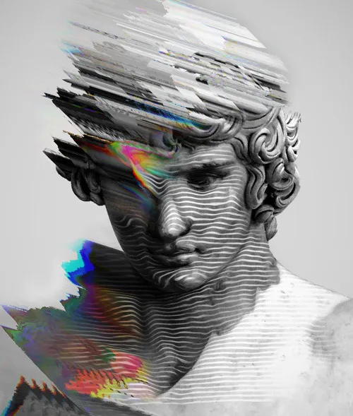

# Postmodernism

|  |               |
| ------------------------------------------------- | ----------------------------------------------------------------- |
| 
 Michelangelo's David (1504) The original Renaissance sculpture 
    | 
 A contemporary image that reproduces and distorts the original 
 |

 
The ideas ending with "ism" are vast and complex because they represent specific ideologies, beliefs and ideas unfolding over a long period of time possibly independently in more than one place across the ocean.

Postmodernism is one of such concept and I will only be looking at a minute aspect of it from the lense of hyperreality.

>"Postmodernism refers to the state of culture where media is produced in such staggering quantities that it has crossed the boundaries into reality itself and hyperreality prevails."

## Historical Background

An oversimplified history of how we arrived at Post-modernism. It actually follows a far more complex timeline than discussed here.

#### Pre-Modern Era (before the 1600s)

In the pre-modern world, religion and classical philosophy dominated public life. In the West, Christianity shaped culture, while in ancient Greece, texts like Homer’s *Odyssey* helped define shared values and beliefs. Religion was the central narrative that guided people’s understanding of the world, and art often reflected this influence through paintings, sculptures, and architecture.

Because most people shared the same beliefs, culture was more unified and stable. However, this began to change during the Protestant Reformation, when new churches challenged the authority of the Catholic Church. As religious certainty weakened, people increasingly turned toward reason and observation. Thinkers like Descartes helped lay the groundwork for this shift.

#### Modernism

Modernism marked a rejection of religious authority in favor of human reason. Descartes became one of its key early figures, emphasizing doubt, logic, and rational thought. As science and technology advanced, they transformed society and reshaped how people understood truth, progress, and reality.

#### Postmodernism

Postmodernism is the period that followed modernism and defines much of the world we live in today. After the devastation of the World Wars and the Great Depression, many people began to question the idea that science and progress always lead to a better world.

At the same time, photography and film created entirely new ways to produce and spread culture. Later, television, advertising, and digital media intensified this process. Consumerism grew, and ads increasingly shaped human behavior rather than simply responding to it.

The culture also keeps getting copied until the simulacrum becomes indistinguishable from the original work it was meant to represent.

## Media no longer depicts reality; It shapes it

In the digital age we are being constantly bombarded with never ending media such as the infinite short form content dominating the majority of the peoples attention.

The reels you watch on Instagram, the videos you see on YouTube, the ads that play before them, the reality shows on TV, the magazines, newspapers, and online posts you read — all of it is media being consumed. And once it enters our daily lives, it becomes part of our reality, as real in its effects as a tree or a car outside the window.

The emergence of human generated brain rot in the past two decades have been overtaken by AI generated slop being produced and distributed at an incredible rate across almost all social media platforms.
### Role of AI

 Go Board Game 

 
Go is a 2000 year old board game invented in China. It is far more complex than chess with an astonishing 10 to the power of 170 possible board configurations.
In 2016 the AlphaGo AI model taught itself to play go in a week. It beat the 18 time world champion by using a startegy no one understood at the time which turned out to be a brilliant strategy.
It made people realise how little the human mind had managed to explore in past 2000 years. The human mind couldn't even conceive the possibilities the model predicted.

The model was trained on human played matches but it managed to push Go beyond any human's imagination.

It's also worth mentoning that while the model was specifically designed to play a game, it is able to aid in solving real world problems as well.

### AI generated media

AI generated images or videos are alien in a way. The models were trained on human generated data but they don't think like humans, they are fundamentally just linear algebra predicting patterns.

AI generated media is not only confined to the digital world but has found its way into the physical reality.
It is increasingly appearing in the print media including newspapers and magazines complementing articles and ads. This also makes one question if the text was also generated by AI.
The buisness ads on streets are increasingly AI generated. 

Today most of it is poorly generated and obvious but the day when it becomes impossible to distinguish AI from reality is not far-it might as well have already arrived.

This means we are living on a planet increasingly being shaped by a non-human intelligence but it naturally becomes part of our reality.

### Homogenization & Fragmentation of culture

The postmodern culture homogenizes the form of culture while fragmenting its experience.

At the macro level, culture is homogenizing: the same platforms, memes, aesthetics, AI content, ads, and global media circulate everywhere, so people increasingly share the same references and surface-level tastes.

At the micro level, culture is fragmenting: algorithms personalize feeds so each person gets a different reality, different micro-trends, different ideologies, and different context. People may live inside separate “media bubbles” even while using the same apps.
