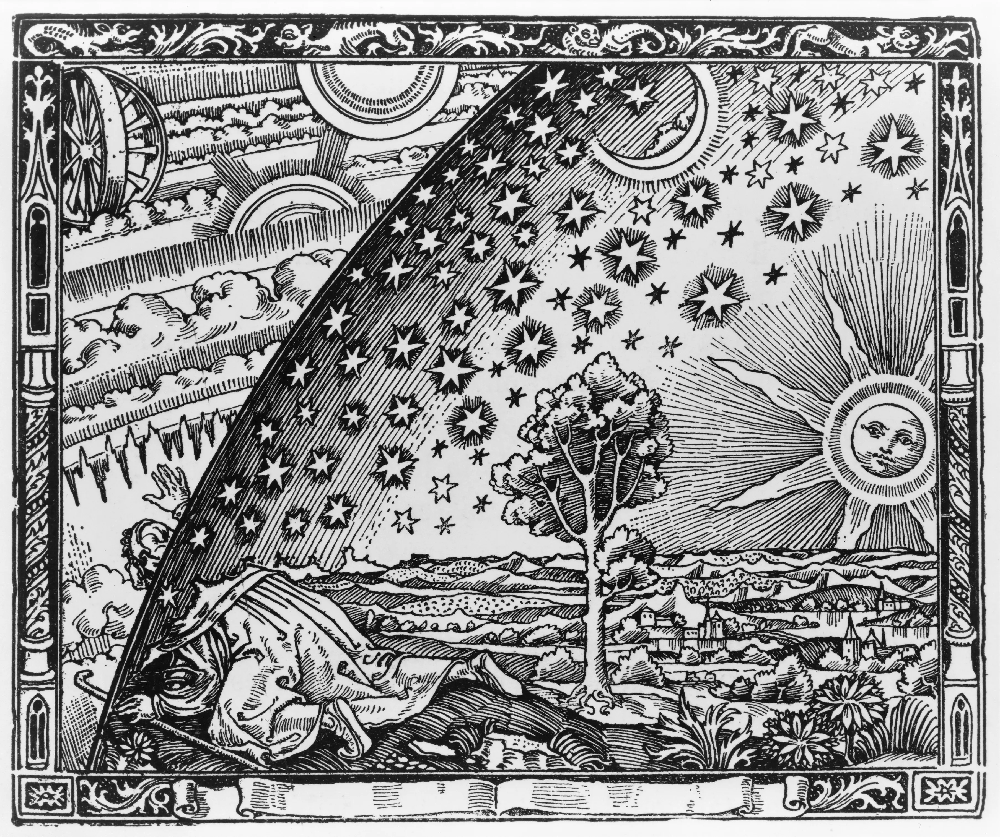
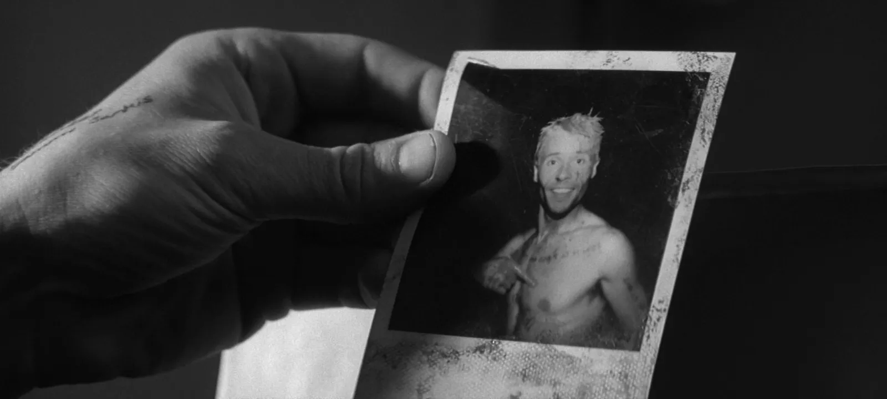

# Reality

Reality is the totality of everything that exists, independently of whether anyone perceives, understands, or believes in it. 

 

Flammarion Engraving (1888)

It depicts a pilgrim-like figure who passes through an opening in the firmament to discover a realm of circling clouds, fires, and suns beyond the sky. 

 
## Origin of Life

Life began on planet Earth by accident. A single protozoan divided, multiplied, and eventually evolved into many different forms of life. A vast majority of the species have already gone extinct, some are on the verge and those we see around us are still undergoing evolution.

All life forms share a common purpose i.e. to survive long enough to be able to reproduce and give birth to offsprings that can do the same and ensure the continuity of their sepcies.
All living organisms are equal and no species not even human beings are more significant than another. This may seem repulsive at first because the society we grow and live in is an artificial construct very opposite to how nature intended us to live.

### Evolution did not shape us to perceive reality

The probability that evolution would shape any particular species—including human beings to perceive reality is effectively zero. It is supported by the game theory of life-a mathematical proof of Darwins theory of evolution as well as through extensive evidence from genetics, fossils, anatomy, observation, and other fields.
For example, the light is colourless, it has no colour but our brain has evolved over the course of millions of years to hallucinate (perceive) particular wavelengths of energy as colours on the electromagnetic spectrum.
It was important to increase the odds of survival by making it easier to identify dangers such as a cliff and not fall into it.

### Brain in a box

Brain is confined in the darkness of the cranium and solely relies on the nervous signals it receives from the various sensory organs of the body to paint a picture of the reality. Think of it as brain wearing a VR headset. Each persons VR headset is slightly different, just like the manufacturing defects in silicon due to which no semiconductor or sensor of a camera can be truely similar in all respects.

This is why what is orange to me is not the same orange to you because we can not wear the other persons VR headset.

Tetrachromacy is a rare genetic disorder affecting around 12% of the women population. It allows the affected individuals to perceive far more colours than a normal individual and is therefore also called 'super vision'. It is estimated that tetrachromatic individuals can perceive 100 million distinct colours compared to only about 1 million colours possible by normal human vision.

Now imagine standing next to a super vision women and looking at a beautiful hill.
Both of you describe what you see to eachother with the limited vocabulary provided by the language. You both find it beautiful but does it appear more beautiful to the super vision eyes capable of transcribing so many more colours ?
### Science is a tool to understand reality

Every scientific theory begins with an assumption and therefore it cannot prove its own assumptions. You can postulate a sub-theory to prove the assumptions of the original theory but now this new theory will have its own assumptions and so on. This is why there cannot be a Theory of Everything.

We can conduct scientific experiments and conclude with certainity that the results appear to be consistent but we cannot say with certainity if its the truth.

### Beliefs shapes Reasoning

During the 16th century, the geocentric model of the Solar System which placed Earth at it's center was most widely accepted until Copernicus made observations that proved that Sun is the actual center of our Solar System— the Heliocentric model was born.

Copernicus was a religious man who believed that the God is perfect so should be his creations. He assumed that the celestial bodies including Earth were perfect spheres that revolved around Sun in a circular path which is perfect from a geometrical perspective. In reality the planets are irregulary shaped ellipsoids and revolve in eleptical orbits. 
The people of the time did not want to let go of the geocentric model, it just felt too beautiful to let go of.
## Types of Reality

### 1. Objective Reality

Objective reality means something confirmed to such an extent that it is reasonable to provide our provisional assent.

 It is not possible for any species to completely perceive the true nature of the universe.

The nature of reality itself may prohibit us from perceiving it directly such as in the case of Heisenberg's Uncertanity Principle.

We can use the tools provided by science to verify observations and establish conclusions with a high degree of confidence.

### 2. Constructed Reality

Constructed reality refers to ideas and beliefs that become as socially real as physical objects, such as the tree outside.

Examples include:

- Belief in God
- Organized religions
- Superstitions
- Political systems
- Social institutions
- Money and other economic systems

## Nature of Human Understanding

Human reasoning is flawed. We have fragmented memories which we tend to fill in to make sense of something - a phenomenon known as confabulation.

### Memory

 Screen grab from Memento (2000) 

 
Memories are not reality but a reconstructed mental representation of the past which makes them more unreliable than we realise.

Memories are not linearly stored like a video refording in the brain. When you remember something, the brain attempts to piece tofether the existing information, experiences, emotions and assumptions to reconstruct the memory.

Because of this the memories can be incomplete or altered while still feeling genuine.

## Various Bias

A bias refers to inclinations that can affect the judgement.
### Confirmation Bias

Brain has a tendency to naturally defends it's beliefs. Therefore often human beings do not reason to reach a conclusion but use reasoning to justify already established conclusions that appear true to them.

People naturally perceive their beliefs to be true such as one's religion or political beliefs. 
They might collect evidence for what they want to be true and ignore the ones that go against it.

### Bayesian Reasoning

It is a concept that can help mitigate the confirmation bias.

A person may have certain beliefs based on certain evidence but they are not concrete.

So this person may easily change their mind when evidence changes such as insights from a new scientific research.

This allows one to be not so commited to their belief's and feel the need to be committed and defend their beliefs.

### Hind Sight Bias

A person may look back after an even and think that they could have predicted the outcomes and it feels obvious and natural.

In reality most of it is random and we are not good at detecting randomness.

### Conspiracy Theories

 

>**Section Under Construction**

 

> Refer to [*The Believing Brain*](resources/books/the_believing_brain.pdf) by Michael Shermer for a better understanding. See the [Resources](resources.md) section for more information.
