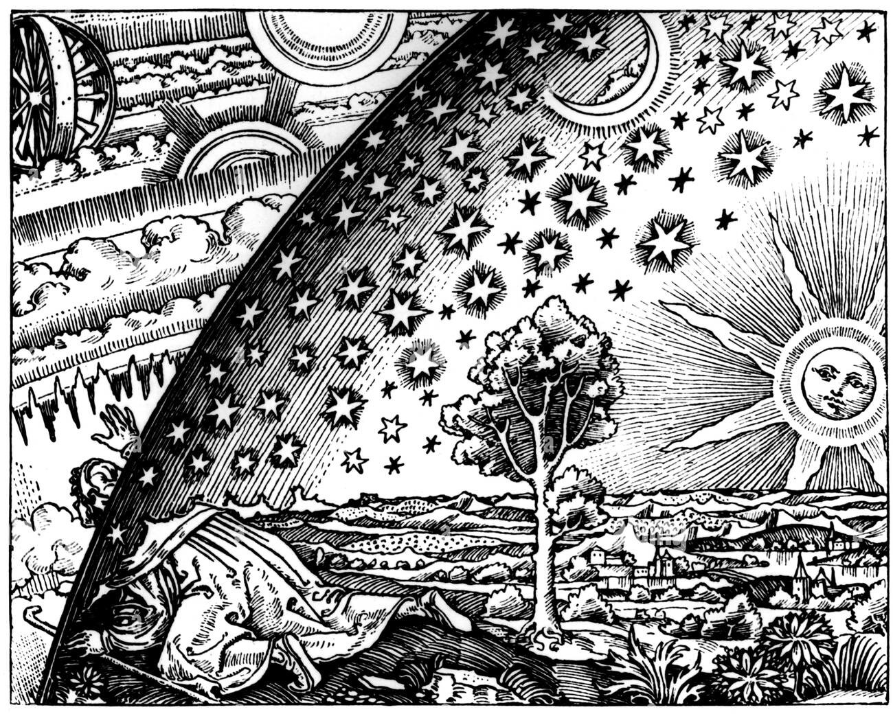

# Reality

Life began on planet Earth by accident. A single protozoan divided, multiplied, and eventually evolved into many different forms of life. A vast majority of the species have already gone extent, some are on the verge and those we see around us are still undergoing evolution.

All life forms share a common purpose i.e. to survive long enough to be able to reproduce and give birth to offsprings that can do the same and ensure the continuity of their sepcies.
All living organisms are equal and no species not even human beings are more significant than another. This may seem repulsive at first because the society we grow and live in is an artificial construct very opposite to how nature intended us to live.

The probability that evolution would shape any particular species—including human beings to perceive reality is effectively zero. According to the game theory of life-a mathematical proof of Darwins theory of evolution.
For example, the light is colourless, it has no colour but our brain has evolved over the course of millions of years to hallucinate (perceive) particular wavelengths of energy as colours on the electromagnetic spectrum.
It was important to increase the odds of survival by making it easier to identify dangers such as a cliff and not fall into it.

In today's constructed society, the ruling class utilizes our flawed understanding of reality to influence, control, and govern the population.

## Types of Reality

### 1. The Reality

The true nature of the universe is impossible for any species to fully perceive.

In other words, the nature of reality itself may prohibit us from perceiving it directly.

### 2. Objective Reality

Objective reality means something confirmed to such an extent that it is reasonable to provide our provisional assent.

We can use the tools provided by science to verify observations and establish conclusions with a high degree of confidence.

### 3. Constructed Reality

Constructed reality refers to ideas and beliefs that become as socially real as physical objects, such as the tree outside.

Examples include:

- Belief in God
- Organized religions
- Superstitions
- Political systems
- Social institutions
- Money and other economic systems
>
Note: we are not targetting religion but merely stating facts, a human no matter how objectively he/she might live need various illusions to live a happy life given how harsh the reality really is and hence its important to respect every persons beliefs and values.
> 
## Nature of Human Understanding

Understanding exists within the confines of an implicit milieu—a shared environment of assumptions, beliefs, language, and experiences held by those embedded within it.

As a result, people often interpret reality according to the framework they have inherited rather than according to reality itself.

## Human Reasoning

> Refer to [*The Believing Brain*](resources/books/the_believing_brain.pdf) by Michael Shermer for a better understanding. See the [Resources](resources.md) section for more information.

Human reasoning is flawed.

Brain defends what it believes in.

A logician or scientist may get frustrated and wonder if only everyone would think logically and believe in modern science, the result would be that world can become so much better and many problems can be solved. Whereas a religious person believes in god and may hate science and wonder how to spread the message of god to everyone so all can walk the righteous path which the god intended.

This is not how reality works and the only way to coexist is to accept and respect eachothers beliefs and values.

As an aetheist who comes from a highly religious family I have observed how people close to me with deep spritual beliefs get frustarted and try to impose their beliefs upon me. The anger that stems from within just because I do not pray is really something to behold. They probably care about me and don't want me to end up in hell and follow god's commandments and so on.

The problem that always arises is how deeprooted their beliefs become that it becomes virtually impossible to penetrate the defensive bubble defending their beliefs. Not even reasoning works here. Because religions seem to be designed carefully with failsafe loopholes. Such as it is wrong to question god, or whatever happens is by the will of  a god.

# Weaponisation Of Religions

As we have seen from above section, religions are really good at trapping people in [Plato's caves](). Thus dividing them at the level of fundamental beliefs.
This phenomenon is being actively exploited by Governments and organisations around the world to perform deeds that I can only describe as true horrors unfolding right in front of our eyes. Some exaples include:

The State of Israel is justifying its killing by comparing their actions to the religious text of Jews.

The US Government being a puppet of Israel has actively maintained how its a moral duty of American Christians to support Israel in its deeds by manipualting the meaning of bible's text.

In India the RSS (a paramilitary organisation) which has one goal of converting India into a pure Hindu nation has actively maintained enemity and racism between majority hindu and the minority muslim population for a long time.

