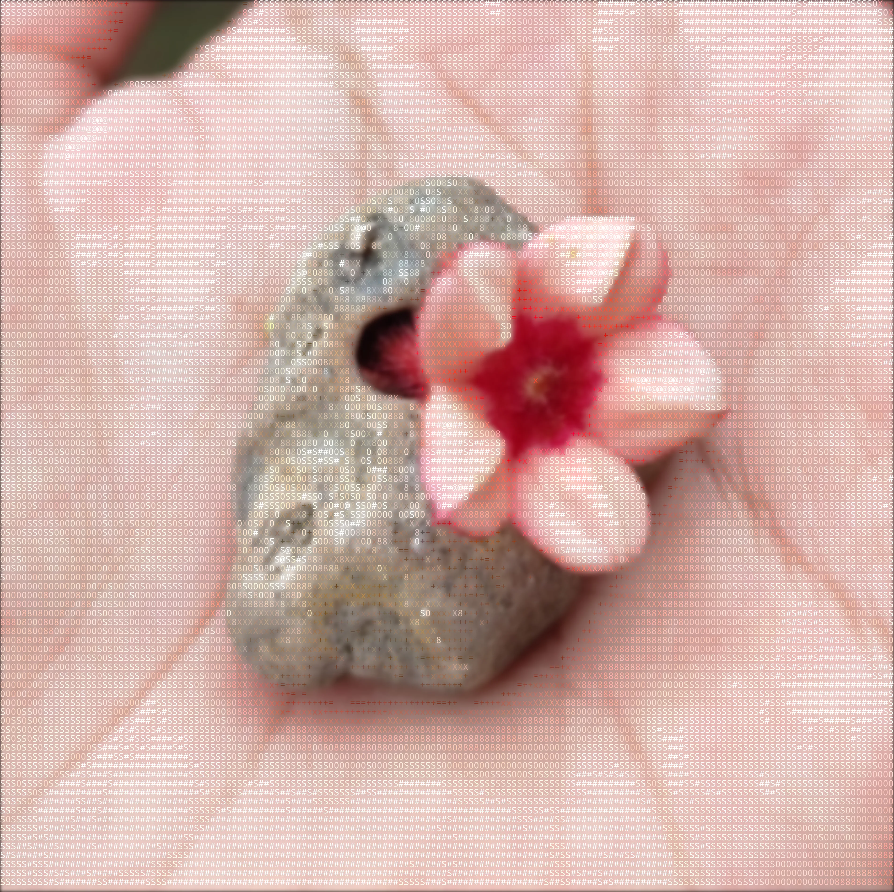
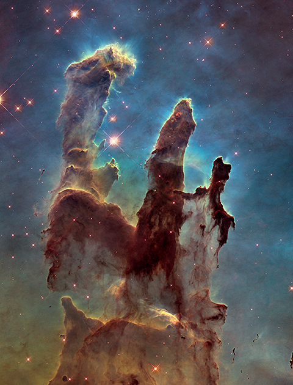

# Contemplating about Our place in the Universe

{ width="50%" }

I found a stone with a see through hole formed from probably sitting in some water stream for a long time. It makes you appreciate the power of time. Each water molecule striking the stone had effectively negligible energy by itself but over a long period of time it managed to penetrate its way through the stone forming a smooth passage which appears to be as natural as the rest of the stone.

Time erodes mountains, lands, cuts rivers through them. This is but a small stone.

It maybe easy to compare wethering of a small stone to that of mountains but now compare there weathering to that of cosmic events. A human mind simply cannot comprehend the scale and time of cosmic events. It just makes you feel so incredibly insignificant. But don't let it make you melancholic, after all the atoms that make up stars and nebulla such as the Pillars Of Creation compose you as well. You are not observing the universe but you are the universe experiencing itself.

The Pillars of Creation standing at a length of 1 Light year.

This means its so big that light itself will require a whole year to travel between the farthest points. One light year is equal to 9460730472580.8 km, which is approximately 9.46 trillion kilometres or 5.88 trillion miles.

The Pillars of Creation are elephant-trunk-shaped clouds of gas and dust in the Eagle Nebula (M16) that are actively forming new stars. They were photographed by the Hubble Space Telescope in 1995, and they are about 6,500–7,000 light-years from Earth.

 
>**Section Under Construction**
