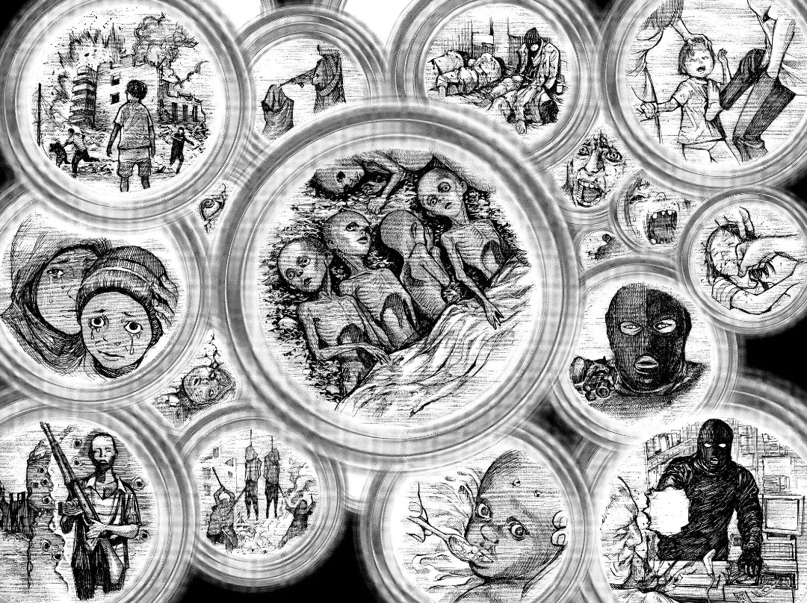

> At present, the comedy of existence has not yet 'become conscious' of itself; at present, we still live in the age of tragedy, in the age of moralities and religions.
 
>~ From [The Gay Science by Friedrich Nietzsche](resources/books/The-Gay-Science-by-Friedrich-Nietzsche.pdf)

 

Stańczyk by Jan Matejko

 

## Reality is harsh and sad

The above painting called _**Stańczyk**_ by Jan Matejko depicts a court jester sitting melancholically in deep thought while a party is going on in background. He is supposed to be lively and happy being a jester but appears alone and serious as he is the sole person with the knowledge that their kingdom will be invaded tomorrow.

We are all alone in the vastness of our observable universe. We are not special and won't even leave a lasting legacy after completing our short human life. There's a saying that people die twice - once when they die and a second time when they will be remembered for a last time. It's natural to feel scared and hopeless in the grand scheme of things.

## Various Beliefs

A belief held by someone refers to a commitement made towards cetain view of reality. Beliefs and actions do not always align.

### Patriotism

Patriotism refers to the love and devotion one feels towards their country.

Patriotism has always been a bullshit concept to me. 

When I was a kid I had been asked by many if I watched Cricket matches to which my usual reply was, 'No'. Then I would be perplexed by their surprised reaction and I never understood for the longest time, why everyone got so worked up when it was a IND vs PAK match.

In first grade back in 2011 our homeroom teacher told us about the bravery of a recently fallen soldier whose parents received some honour called  Param Vir Chakra. She even put a picture of him and the medal thing on the soft board at the back of the class and I just found it all funny at best.

The school assemblies promoted it, the sports promoted it and not to mention the many ads and propaganda that glorify the millitary. 

If a soldier of one country murders an enemy soldier from another (to defend his country of course) then its not considered murder and the deceased soldiers on both sides are glorified to have sacrificed thier lives for their country whereas those who manage to make it back alive are showered with medals and praise.

The ability of the Governments to sustain entire armies of brainwashed patriotic youths is commendable.

### Afterlife

[Death](death.md) is scary but beliefs that one day, people can transcend to a better place and reunite with the people they lost eases suffering and dealing with grief caused from loosing a loved one or the fear of death itself.

### Religion and God

Believing that an all powerful, omnipresent being is always looking after you makes it easier to live life for many people especially when reality has been really unforgiving to them.

I do not consider myself a nihilist based on my understanding of the term, but certain aspects of nihilism resonate with me. A consequence of being an atheist from this perspective is understanding how meaningful religion makes one's life for the people living in blissful ignorance.

For people under suffering, uncertainty, grief, or fear. If religions give life meaning, if they make life worth living then they in turn promote the continuity of the species.

Perhaps this is why they still persist even if they reduce intellectual rigidity or relaism; they pretend to answer psychological needs that raw reality often does not: meaning, consolation, identity, and social order.

But this is the biggest problem with religions; the submission of individuals to their religion, undermining their reasoning and curiosity and the very **distortion** in perceiving the **real truth** because of an absence of any self-correcting mechanism.

*Some people live in towers so tall, they look down upon the clouds.*

*Others sit on the ground without home around them resisting starvation.*

*Some people eat everything they want and throw away the rest. Others cannot have a single cup of water to drink.*

*Some people rule over the weak. Others have their lives ripped away from them.*

*AND*

*Hundreds of Millions offer their prayers to God.*

~ **Platinum End by Tsugumi Ohba**

 

### Lack of Self-Correcting Mechanism

When a baby first tries to walk, it tends to fall down. It may be guided by it's parents but he/she has to figure out why they fell down and try something different the next time. 

Religions have no self correcting mechanism. They claim their holy texts to be God's commandments which are perfect and absolute. The times have changed greately since they were written and while you can interpret them in differnet ways, there is no way to correct them.

Science works because it’s suspicious of itself. Every claim is temporary, every conclusion is on probation. It keeps on improving and expanding everyday.
The Scientific journals publish mostly the corrections made over previous knowledge.
There are barely any new discoveries but a major part is researching what we already know to improve our understanding and derive knowledge and ideas.

### How to construct a Belief System such as Religion

If you want to make a new system of belief, make up a lot of stories and bombard people with it until they are overwhelmed. However there should be some truth to it, as a system compeltely oblivious to truth will eventually collapse.
And finally make it devoid of any self correcting mechanism.

If I ask you to picture Jesus Christ you can easily do so but in reality every depiction of Jesus is fictional as there is absolutely no description of him in Bible nor were any portraits made during his life time.

When enough people believe in something it influences their art and culture which in turn is perceived as reality not only to them but to others who are also a part of the culture.
## Weaponisation Of Religions

Religions are really good at trapping people in Plato's caves. Thus dividing them at the level of fundamental beliefs.

This phenomenon is being actively exploited by Governments and organisations around the world to perform deeds that I can only describe as true horrors unfolding right in front of our eyes. Some examples include:

## Israel

The State of Israel is justifying its [genocide of gaza](gaza.md) by comparing their actions to the religious text of Jews.

Prime Minister Benjamin Netanyahu said that Israelis were united in their fight against Hamas, whom he described as an enemy of incomparable cruelty. “They are committed to completely eliminating this evil from the world,” Netanyahu [said](https://www.youtube.com/watch?v=P5LmB6uup3o&ab_channel=SkyNews) in Hebrew. He then added: “You must remember what Amalek has done to you, says our Holy Bible. And we do remember.”

There are more than 23,000 verses in the Old Testament. The ones Netanyahu turned to, as Israeli forces launched their ground invasion in Gaza, are among its most violent—and have a long history of being used by Jews on the far right to justify killing Palestinians.

Israel has bombed two synagogue's so far in Iran to persuade the minority jewish population residing there to migrate to Israel. The constitution of Iran gave rights to minority population to practice their religion and yet some of the Jews are destroying their own temples for their cause. This instance suggests that the Elites who control the system do not believe or fear God themselves but exploit the belief of normal people for their own benefits.

The two bombings were justified as being hit mistakenly while targeting nearby adversaries.

## Girl Brides of Yemen

Yemen is under the influence of Sharia Law and has currently no minimum legal age of marriage since 1999 when Yemen’s parliament, citing religious grounds, abolished article 15 of Yemen’s Personal Status Law, which set the minimum age for marriage for boys and girls at 15.

It is **common** for girls to get married from as early as ages 8 and get **pregnant** by 13 years of age. I cannot even begin to grasp the conditions and psychological trauma of these poor little girls who get pregnant with their underdeveloped mind and body and face highest mortality rates in the region.

There are many factors governing this phenomenon but the fact that Prophet Mohammad also married his first wife—Aisha when she was only 9 becomes a driver when the lesser educated followers of Islam naturally follow their prophet's footsteps. The parliament has clearly weaponized religion here.

## USA

The US Government being a puppet of Israel has actively maintained how its a moral duty of American Christians to support Israel in its deeds by manipualting the meaning of bible's text.

## India

In India the RSS (a paramilitary organisation) which has one goal of converting India into a pure Hindu nation has actively maintained enemity and racism between majority hindu and the minority muslim population for a long time.

